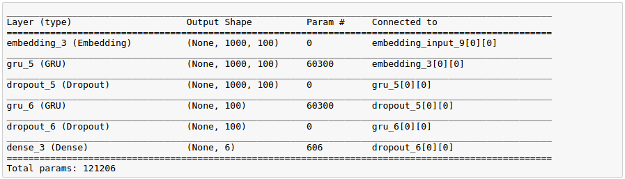
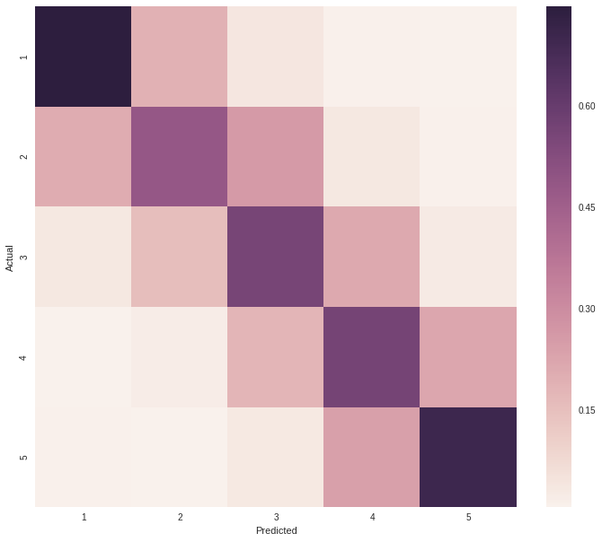
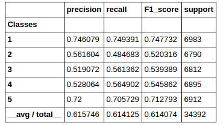
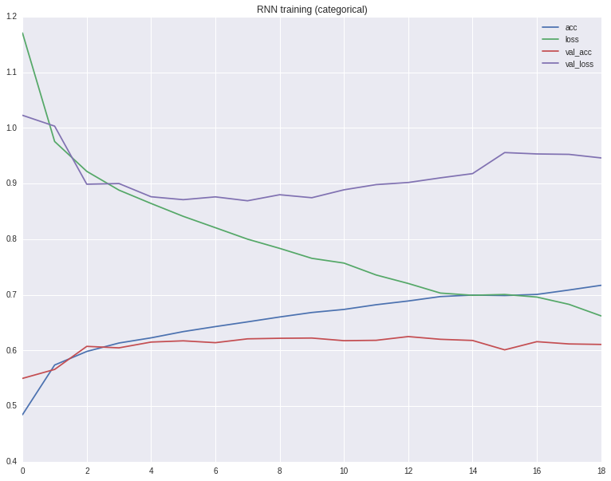

#  

### 1) simple exploration

Simple exploratory notebook used to get a feel of the dataset
can be found here:  
https://github.com/i008/nyyelp/blob/master/exploration.ipynb

### 2) NLP project 

The notebook for this project can be found here:  
https://github.com/i008/nyyelp/blob/master/nlp.ipynb

#### main objective:
Predict review rating (how many stars the reviewer gave to given POI) given the textual-content of the review using pretrained **GLOVE** word embeddings and a 2 layers deep **GRU(LSTM)** recurrent neural network. Visualize clusters on a 2D space using PCA and t-SNE.

#### Steps(rough plan):

1) Process .text data from yelp review-documents
- filter to leave english-only reviews
- balance the dataset (use similar amount of data for each star rating (1,2,3,4,5*)
- balance the dataset by review length, so the length distribution of reviews for each rating-class is atleast similar (bucketing might be a good idea)

2) Process text for deep-learning
- bring  GLOVE embeddings to a reasonable form
- Tokenize each review 
- transform reviews into tokenized sequences
- Pad sequences to a fixed length
- Prepare the embedding weight-matrix to be used in the Embedding layer (we will not train this layer)
- split into test and train

3) Deep learning
- loss function, regression(rmse) and/or classification(logloss)
- prepare architecture (2-3 LSTM layers -> Dense)
- train, wish for the best

4) Post learning
- extract features from last LSTM layer
- casting to 2D space using t-SNE

5) Remarks
- we have to limit the amount of data, bc of memory issues possible solution is to save the sequences into HDF and flowing from disk during training

# Summary

1) Data used:  
- For performance and memory reasons the final model was trained on a balanced and downsampled (by a factor of 10) subset of the dataset Leaving us aorund 150,000 reviews (in total)
- Review data was tokenized (20,000 words)
- Max sequence length was set to 1000.
- Embedding dimensions were set to 100 (GLOVE-100d representation was used) wich means every words is a vector with shape (100,)

2) Deep Learning Model  

- The Embedding layer used GLOVE (http://nlp.stanford.edu/projects/glove/) weights and training of this layer was disabled
- The objective function was logloss wich means that it was a classification task , altough regression would also  be a valid option

3) Results 
 
fig1. confusion matrix :    

fig2. classification report:   

fig3. Learning process:  

As we can see on the images above the model managed to learn (something) and achieved decent accuracy(~0.65).
   
Key takeways: 
 - Extreme(1,5) reviews are easier to classify and understand, people write them in a specific way.
 - As we can see on fig1. The model makes mistakes almost only "by 1-star" this is a very good sign and leads to the conclusion that the "grduation" of the data was learned to some degree
 

4) Learning Performance
- On epoch (~130,000 reviews) with a batch size of 128 reviews took around 15mins on  a GTX1070.

 

