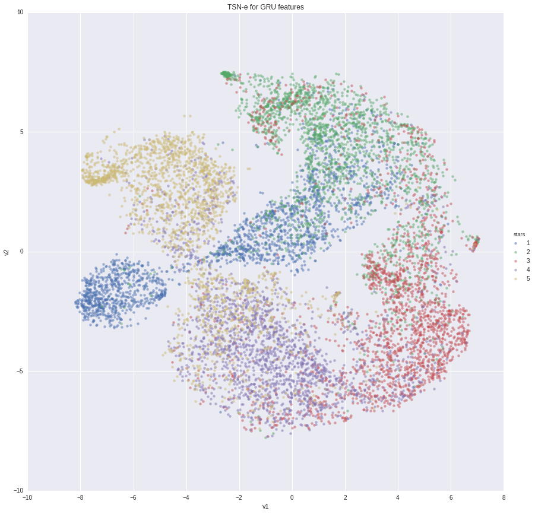
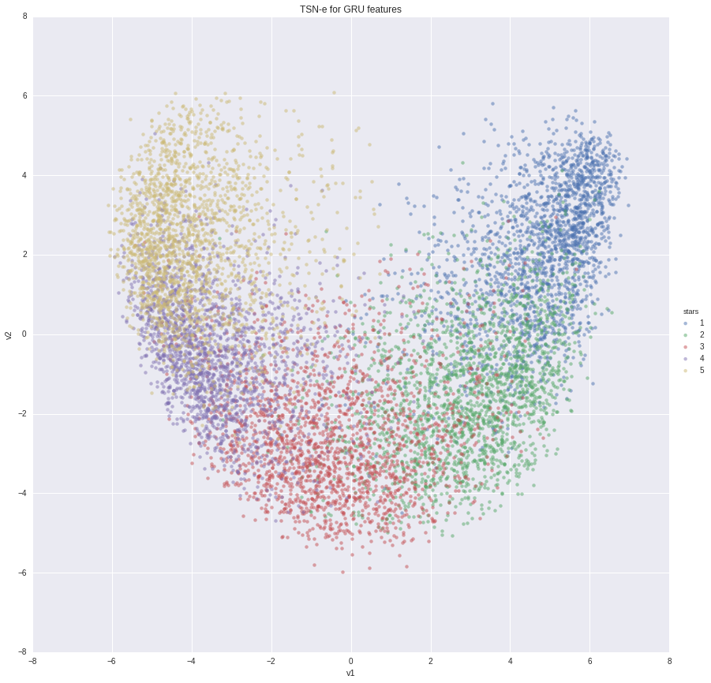

# Project objective:
Predict review rating (how many stars the reviewer gave to given POI) given the textual-content of the review using pretrained **GLOVE** word embeddings and a 2 layers deep **GRU(LSTM)** recurrent neural network. Visualize clusters on a 2D space using PCA and t-SNE.


#### simple yelp-dataset exploration
yelp data: https://www.yelp.de/dataset_challenge  
notebook used to load and explore basic properties of this dataset can be found here:  
https://github.com/i008/nyyelp/blob/master/exploration.ipynb

#### NLP project 
The notebook for the NLP part of this project can be found here:  
https://github.com/i008/nyyelp/blob/master/nlp.ipynb


#### Steps(rough plan):

1) Process .text data from yelp review-documents
- filter to leave english-only reviews
- balance the dataset (use similar amount of data for each star rating (1,2,3,4,5*)
- balance the dataset by review length, so the length distribution of reviews for each rating-class is atleast similar (bucketing might be a good idea)

2) Process text for deep-learning
- bring  GLOVE embeddings to a reasonable form
- Tokenize each review 
- transform reviews into tokenized sequences
- Pad sequences to a fixed length
- Prepare the embedding weight-matrix to be used in the Embedding layer (we will not train this layer)
- split into test and train


3) Deep learning
- loss function, regression(rmse) and/or classification(logloss)
- prepare architecture (2 LSTM/GRU layers -> Dense)
- train, wish for the best

4) Post learning
- extract features from last LSTM layer
- casting to 2D space using t-SNE

5) Remarks
- we have to limit the amount of data, bc of memory issues possible solution is to save the sequences into HDF and flowing from disk during training

# Summary

### text Data:  
- For performance and memory reasons the final model was trained on a balanced and downsampled (by a factor of 10) subset of the reviews leaving us around 150,000 reviews (in total)
- Review data was tokenized (20,000 words)
- Max sequence length was set to 1000.
- Embedding dimensions were set to 100 (GLOVE-100d representation was used) wich means every words is a vector with shape (100,)


### Deep Learning Model  


- The Embedding layer used GLOVE (http://nlp.stanford.edu/projects/glove/) weights. Training of this layer was disabled
- The objective function was logloss wich means that it was a classification task , altough regression would also  be a valid option
- After the 3rd-4th epoch we can observe that the model starts to overfit

### Results 
 
fig1. confusion matrix :    


fig2. classification report:   


fig3. Learning process:  


As we can see on the images above the model managed to learn (something) and achieved decent accuracy(~0.62).
   
Key takeways: 
 - Extreme(1,5) reviews are easier to classify and understand, people write them in a specific way.
 - As we can see on fig1. The model makes mistakes almost only "by 1-star" this is a very good sign and leads to the conclusion that the "grduation" of the data was learned to some degree
 

### t-SNE and PCA on GRU features

t-SNE and PCA are dimmensionality reduction techniques, used on the features from last GRU layer they can give us an "2D"
idea of the problem we are tackling.

fig4. t-SNE  



fig5. PCA  



### Learning Performance
- One epoch (~150,000 reviews) with a batch size of 128 reviews took around 15mins to train on a GTX1070.


### Docker app (try it yourself)

```bash
docker run i008/nyyelp:latest python predict.py --review "this place really sucks, food is terrible"
```

>number of stars: 1

```bash
docker run i008/nyyelp:latest python predict.py --review "i have mixed feeling about this place, on one hand its good on the other not really"
```

>number of stars: 3


### TODO, Ideas

- Treat this problem as regression and see what happens
- Cluster GRU features using DBSCAN or similar methods, might give interesting results.
- Use more data to train the models.
- Balance the dataset considering the length of the review.
- 


